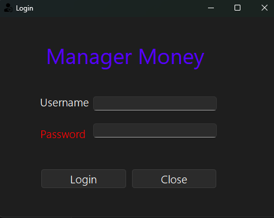
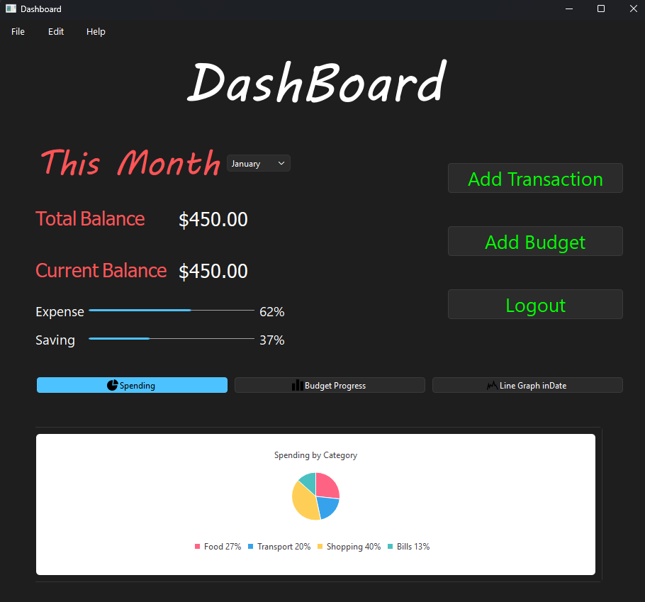
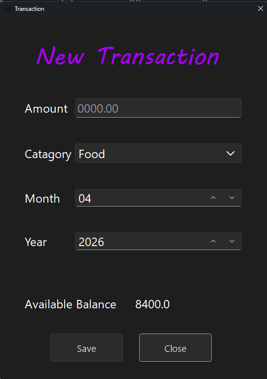
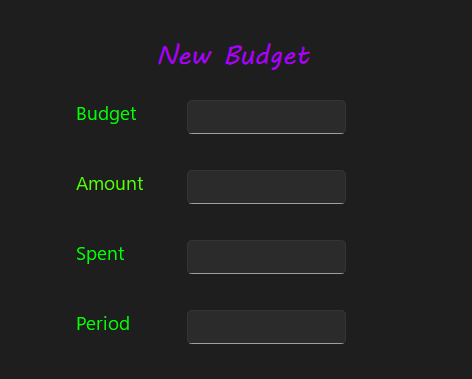

# 💰 Money Manager App
> Organize your finances. Track your money. Plan smarter.

A modern and scalable financial management tool built in Python using a clean **3-Tier Architecture** and **SOLID principles**.

---

## 📑 Table of Contents

- [🧾 Introduction](#-introduction)
- [✨ Features](#-features)
- [🖼️ Screenshots](#️-screenshots)
- [🧱 Architecture](#-architecture)
- [📂 Project Structure](#-project-structure)
- [📦 Requirements](#-requirements)
- [⚙️ Installation](#️-installation)
- [▶️ Run the App](#️-run-the-app)
- [🙌 How to Contribute](#-how-to-contribute)
- [🔮 Future Enhancements](#-future-enhancements)
- [📝 License](#-license)
- [🔗 Contact](#-contact)

---

## 🧾 Introduction

**Money Manager** is a clean financial management application designed to help you:

- Track expenses and income
- Organize transactions into categories
- Plan monthly budgets
- View financial analytics through charts
- Take notes and set goals

Built using:

| Technology | Purpose |
|---|---|
| Python 3.10+ | Core language |
| PySide6 | GUI framework |
| SQLite | Local database |
| 3-Tier Architecture | Clean separation of concerns |
| Repository Pattern | Data access abstraction |
| SOLID Principles | Scalable & maintainable code |

---

## ✨ Features

- 📘 Track expenses & income
- 🏷️ Categorize transactions
- 📆 Monthly budget planning
- 📊 Dashboard with charts
- 🗒️ Notes & financial goals
- 🏛️ Clean and scalable architecture
- 🗄️ SQLite with Repository Pattern
- 🔌 Easy to extend or migrate (API / mobile / web)

---

## 🖼️ Screenshots

| Login | Dashboard | Transaction | Budget |
|-------|-----------|------------|--------|
|  |  |  |  |

---

## 🧱 Architecture

```
┌─────────────────────────────┐
│      Presentation Layer     │  ← PySide6 GUI / CLI
├─────────────────────────────┤
│    Business Logic Layer     │  ← Services, Validation, Calculations
├─────────────────────────────┤
│        Data Layer           │  ← SQLite + Repository Pattern + Interfaces
└─────────────────────────────┘
```

---

## 📂 Project Structure

```bash
Expense_Track/
├── .gitignore
├── LICENSE
├── README.md
│── money_manager/
│   ├── data/
│   │   ├── database.py
│   │   └── repositories/
│   │   └── interfaces/
│   ├── services/
│   ├── database/
│   ├── resources/
│   │   └── Icon/
│   ├── ui/
│   ├── main.py
│── └──requirements.txt
```

---

## 📦 Requirements

```
Python 3.10+
PySide6
SQLite (included with Python)
```

Install dependencies:

```bash
pip install -r requirements.txt
```

---

## ⚙️ Installation

```bash
# 1. Clone the repository
git clone https://github.com/anasemadanas/Expense_Track.git

# 2. Navigate to the project folder
cd Expense_Track/money_manager

# 3. Install requirements
pip install -r requirements.txt
```

---

## ▶️ Run the App

```bash
python main.py
```

> Make sure you're inside the `money_manager/` folder before running.

---

## 🙌 How to Contribute

Pull Requests are welcome! Follow these steps:

1. **Fork** the repository
2. **Create** a feature branch → `git checkout -b feature/your-feature`
3. **Commit** your changes → `git commit -m "Add: your feature"`
4. **Push** to your branch → `git push origin feature/your-feature`
5. **Submit** a Pull Request

---

## 🔮 Future Enhancements

- 📱 Android version (Kivy / Flutter)
- 🌐 Web version (FastAPI + React)
- ☁️ Cloud sync
- 🧾 PDF reports
- 🤖 AI-powered spending predictions
- 🎨 Modern UI redesign

---

## 📝 License

MIT License — see the [LICENSE](LICENSE) file for details.

---

## 🔗 Contact

| Platform | Link |
|---|---|
| 🐙 GitHub | [GitHub](https://github.com/anasemadanas/) |
| 💼 LinkedIn | [LinkedIn](https://www.linkedin.com/in/eng-anasemad/) |
| 📧 Email | [Email](mailto:anaspython3@gmail.com) |

[↩️ Back to Table of Contents](#-table-of-contents)
